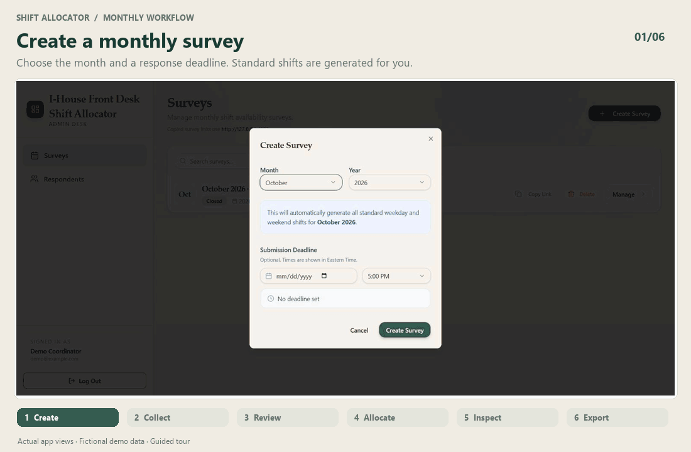
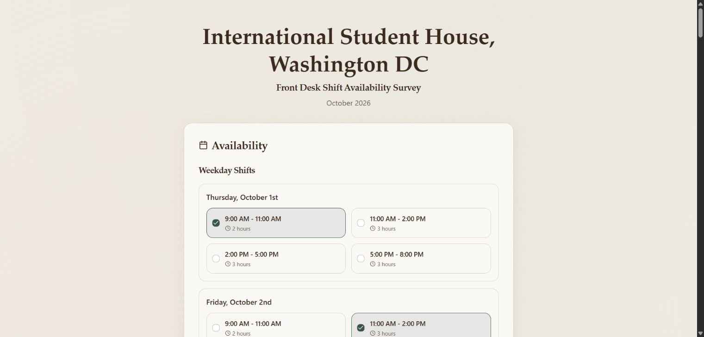
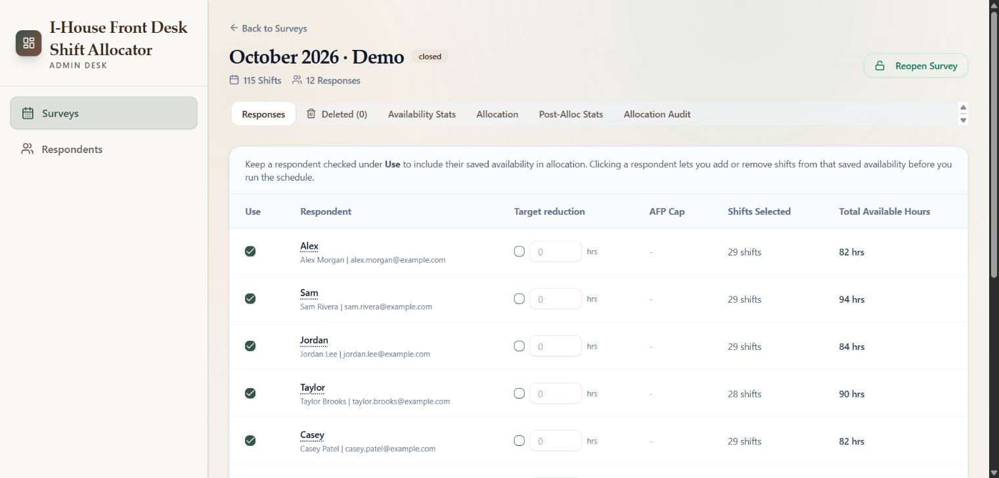
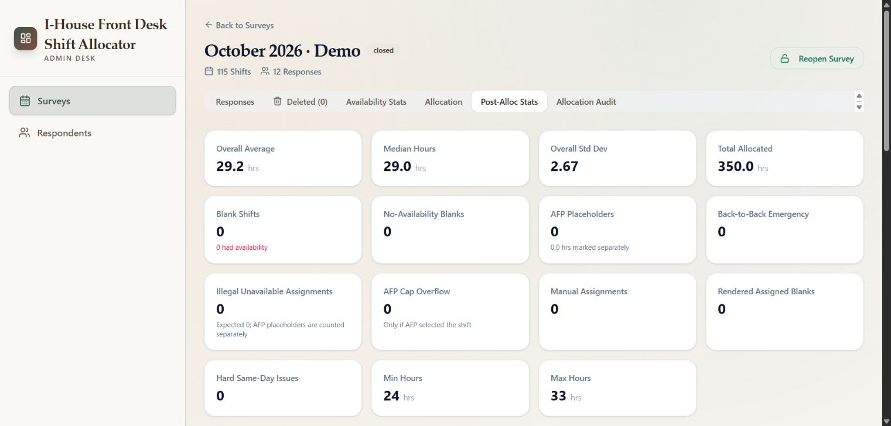
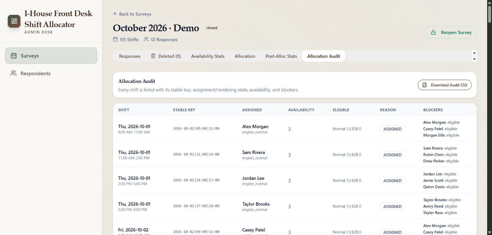
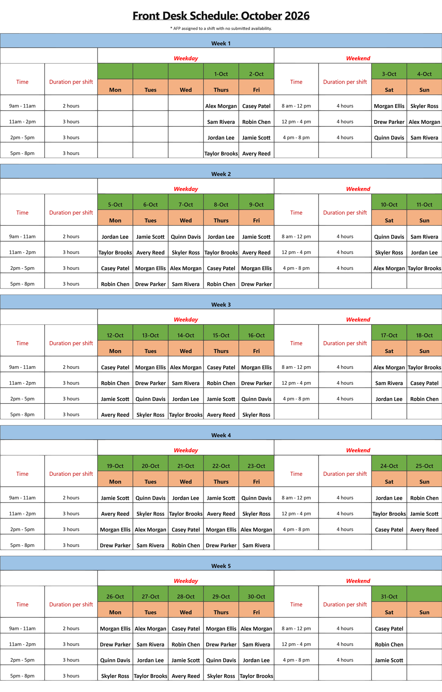

<h1 align="center">Shift Allocator</h1>

<p align="center"><strong>From everyone's availability to a schedule you can explain.</strong></p>
<p align="center">Collect availability, balance monthly shifts, review the exceptions, and export a readable calendar.</p>
<p align="center">
  <a href="LICENSE"></a>
  
  
</p>

<p align="center"></p>

**Shift Allocator** is an open-source scheduling application originally built for the front desk at **International Student House, Washington, DC**. The repository was previously named `ISH-Front-Desk-Allocator`. It is useful anywhere a monthly duty roster has outgrown one spreadsheet and a heroic coordinator.

The app retains its I-House theme and terminology. AFP means *Ambassador Fellow*; AFP participants can have an optional monthly hour cap. General participants and uncapped AFPs join the ordinary allocation pool. Other organizations can adapt the shift templates, category labels, and rules to their needs.

[Features](#what-you-can-do) · [Screenshots](#a-look-inside) · [Try-the-interface](#try-the-interface-with-demo-data) · [Setup](#run-your-own-instance) · [Development](#development) · [Security](SECURITY.md)

> All screenshots and the animation show the actual app running locally with fictional names and `example.com` addresses. The schedule is an illustrative fixture, not a production roster or an optimizer benchmark. The guided animation combines captured app views; no resident data is included.

## What You Can Do

| Stage | Tools |
| --- | --- |
| Collect | Generate a month's shifts, set a response deadline, share a token-based survey link, and close or reopen collection. |
| Review | Inspect and edit submitted availability; include or exclude people from a run; configure optional AFP caps and penalty hours. |
| Allocate | Preview an allocation with a dry run, then save it. The optimizer considers coverage, availability, hour balance, caps, and same-day constraints. |
| Explain | Compare hours against targets, inspect who was available for a shift, and review reasons for blanks or exceptional assignments. |
| Adjust | Make manual changes, preserve manual assignments on reruns, and restore saved allocation recovery points. Deleted responses have a separate recovery workflow. |
| Share | Display a monthly calendar and export PNG, PDF, editable Excel, allocation CSV, or audit CSV. Review respondent allocation history across months. |

### How Allocation Works

Coverage comes first. Within the constraints, the allocator balances eligible hours and limits avoidable back-to-back duties. The global optimizer uses **HiGHS**; diagnostics distinguish an exact result, a bounded result, and a fallback. Availability and competing constraints can prevent perfectly equal hours or full coverage.

Normal assignments require submitted availability. Adjacent same-day shifts can be used as a back-to-back emergency; non-adjacent doubles and three shifts in one day are prohibited. Optional AFP overflow and no-availability placeholders are explicit modes, with separate audit labels and statistics. Placeholder assignments are marked with an asterisk in exports.

Penalty hours are deducted from neutral targets, with capacity limits and unmet deductions surfaced for review. Manual assignments are included in the workload calculation. A dry run helps you inspect the proposed result before saving it; recovery points help you undo later changes.

## A Look Inside

### 1. Collect Availability

A public survey groups weekday and weekend shifts, totals selected hours, and gathers respondent details. People choose the shifts they can actually work. Remembering details on the device is optional.



### 2. Review Responses

See submitted hours and categories together. The **Use** checkbox controls participation in the next allocation; the response editor handles availability, caps, and penalties.



### 3. Inspect the Result

Post-allocation statistics show coverage, workload distribution, and exceptions. The **Allocation Audit** gives a per-shift view of the assignment and available candidates. Both help answer why someone received a shift—or why a shift is blank.



<details>
<summary>View the per-shift audit</summary>



</details>

### 4. Export the Schedule

The monthly calendar puts names directly into shift cells. Export an image or PDF for circulation, or an editable Excel workbook for further formatting. Inspect the final schedule before sharing it.



## A Typical Month

1. Create a survey for the month and set the deadline.
2. Share its public link with respondents.
3. Close collection, review the responses, and choose who participates.
4. Set any caps or penalties, then run a preview.
5. Review coverage, workload, and the audit; save the allocation when satisfied.
6. Make any manual adjustments and export the calendar.

The dashboard keeps previous months available. Respondent history, recoverable response deletions, and allocation snapshots support ongoing administration rather than one-off schedule generation.

## Try the Interface With Demo Data

Requires **Node.js 24** and **pnpm 10.33.0** (pinned in `package.json`). No database or account is needed for this documentation preview.

```bash
git clone https://github.com/zsherkar/shift-allocator.git
cd shift-allocator
corepack enable
pnpm install --frozen-lockfile
pnpm --filter @workspace/shift-scheduler build
node scripts/docs-demo.mjs
```

Open **http://127.0.0.1:4387/admin/surveys** or the [local demo survey](http://127.0.0.1:4387/respond/demo-october).

This is a **read-only fixture server** for exploring the interface and reproducing the documentation images. It binds only to loopback, uses no production credentials or database, and rejects writes. It does not run the allocation engine. Use a real instance to create surveys, submit responses, or run allocations. See [media provenance and regeneration](docs/media.md).

## Run Your Own Instance

### Docker Compose

Install Docker with Compose. Clone the repository, then:

```bash
cp .env.production.example .env.production
node scripts/hash-admin-password.mjs
```

The password helper prompts without echoing your password and prints a hash and `ADMIN_USERS_JSON` example. Fill the placeholders in `.env.production` before starting the stack:

| Variable | Purpose |
| --- | --- |
| `POSTGRES_PASSWORD` | Database password; use the same value in `DATABASE_URL`. |
| `DATABASE_URL` | PostgreSQL connection string; Compose uses the `postgres` hostname. |
| `SESSION_SECRET` | A long random secret for signing admin sessions. |
| `ADMIN_USERS_JSON` | Admin names/emails and password hashes from the helper. |
| `PUBLIC_APP_URL` | The externally reachable HTTPS origin used for copied survey links. |
| `TRUST_PROXY` | Set to `true` behind your trusted reverse proxy. |

```bash
docker compose --env-file .env.production up --build -d
```

The startup script applies the database schema and starts the API. Put HTTPS in front of a public deployment; secure session cookies are enabled in production. For a local HTTP-only evaluation, `COOKIE_SECURE=false` can be set in the local environment file—remove that override for an HTTPS deployment.

Admin login is at `/admin/login`; public surveys use `/respond/<token>`. Keep the PostgreSQL volume backed up and retain `.env.production` securely outside version control.

See [deployment details](DEPLOYMENT.md), [self-hosting with Docker and Caddy](ZERO_COST_SELF_HOSTING.md), and [security boundaries](SECURITY.md). The app does not require a paid API or hosted AI service. Hosting resources remain your responsibility.

### Existing Render Deployment

`render-monthly-hosting` is the deployment branch for the existing I-House instance. `master` is the default development branch. Keep changes merged forward between them; avoid independent fixes drifting across both branches. The repository rename does not rename the existing Render service, database, or public URL. `render.yaml` has automatic deployment disabled; pushing code alone does not deploy it.

## Development

Use Node.js 24, the pinned pnpm version, and PostgreSQL for a functional local instance. Shell environment variables must be supplied to the API; the local Node commands do not automatically load `.env.production`.

```bash
pnpm install --frozen-lockfile
pnpm --filter @workspace/db run push
pnpm --filter @workspace/api-server dev
```

Run the API with `PORT=4000`, a local `DATABASE_URL`, `SESSION_SECRET`, and `ADMIN_USERS_JSON`. In a second terminal run `pnpm --filter @workspace/shift-scheduler dev`; Vite serves port 3000 and proxies `/api` to port 4000 by default. Use development-only credentials. The database push command also needs `DATABASE_URL`.

| Command | Checks or output |
| --- | --- |
| `pnpm test` | Allocation rules, recovery/membership logic, export behavior, and dependency security regressions. |
| `pnpm run typecheck` | Shared libraries, API, and frontend types. |
| `pnpm run build` | Typecheck plus production frontend and API builds. |
| `pnpm audit` | Known advisories in the resolved dependency graph. |
| `pnpm --filter @workspace/api-spec run codegen` | Regenerate client and Zod contracts after changing the OpenAPI spec; inspect generated changes. |
| `pnpm run smoke:deploy-local` | Build and check local production startup/pages with your configured environment. |

### Repository Map

```text
artifacts/shift-scheduler/   React frontend, survey form, admin UI, exports
artifacts/api-server/       Express routes, allocation engine, optimizer, auth
lib/api-spec/              OpenAPI source and Orval configuration
lib/api-client-react/      Generated client and React Query integration
lib/api-zod/               Generated validation contracts
lib/db/                    Drizzle schema and PostgreSQL access
scripts/                   Deployment helpers, security tests, docs preview
docs/                      Screenshots, media provenance, maintenance reports
```

React, Vite, Tailwind, Express, PostgreSQL, Drizzle, Zod, Orval, and HiGHS form the core stack. ExcelJS, jsPDF, and html2canvas support exports. Shift times are defined in `artifacts/api-server/src/lib/shiftGenerator.ts`; fairness and feasibility rules live alongside the allocation engine and optimizer tests.

## Contributing

Bug fixes, clearer allocation explanations, accessibility improvements, and export polish are welcome. Open a focused pull request against `master`, explain the behavior change, and run the relevant checks. Add a regression case when changing allocation rules. Use fictional data in issues and screenshots; never commit secrets or resident information.

## License

Copyright (c) 2026 Ziauddin Sherkar. Released under the [MIT License](LICENSE), provided **as is**, without warranty. Please sanity-check the schedule before sending it to everyone.
